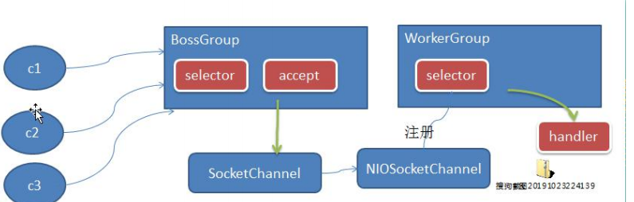
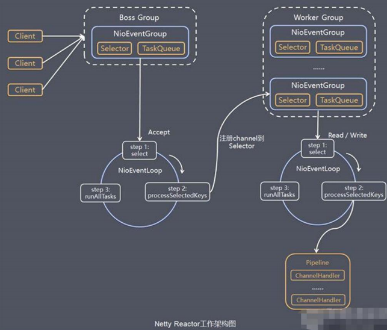

Netty模型

Netty主要基于主从Reactors多线程模型作了改进



- BossGroup线程维护selector,只关注Accept事件
- 当接受到Accept事件，获取对应的SocketChannel,封装成NIOSocketChannel并注册到WorkerGroup,进行维护
- 当WorkerGroup线程监听到selector中的通道发生了自己感兴趣的事件后，就找到handler进行处理

工作原理详细图



- Netty抽象出两组线程池，BossGroup专门负责接收客户端的连接，WorkerGroup专门负责网络的读写
- NioEventLoopGroup是一个事件循环组，每一个事件循环都是NioEventLoop
- NioEventLoop表示一个不断循坏的执行处理任务的线程，每个NioEventLoop都有一个selector,用于监听绑定在上面的socket网络通讯
- 每个Boss NioEventLoop执行步骤 
  - 轮询accept事件
  - 处理accept事件，与client建立连接，生成NioSocketChannel，并将其注册到某个worker 上
  - 处理任务队列的任务，即runAllTasks
- 每个worker  NioEventLoop的执行步骤
  - 轮询read，write事件
  - 处理读写事件，在对应的NioSocketChannel处理
  - 处理任务队列的任务，即runAllTasks
- worker处理读写事件时，使用pipeline，其中包含了channel,维护了很多的handler

Netty TCP实例

NettySever.java

```java
public class NettyServer {

    public static void main(String[] args) {
        //两个group
        //bossgroup，专门用来处理客户端的连接
        EventLoopGroup bossGroup = new NioEventLoopGroup(1);
        //workgroup，专门用来处理读写事件
        EventLoopGroup workGruop = new NioEventLoopGroup();

        try{
            //服务端的启动对象ServerBootStrap
            ServerBootstrap bootstrap=new ServerBootstrap();
            //设置参数
            bootstrap.group(bossGroup, workGruop)
                    .channel(NioServerSocketChannel.class)
                    .option(ChannelOption.SO_BACKLOG,128)
                    .childOption(ChannelOption.SO_KEEPALIVE,true)
                    .childHandler(new ChannelInitializer<SocketChannel>() {
                        //给pipeline设置处理器
                        @Override
                        protected void initChannel(SocketChannel channel) throws Exception {
                            //自定义一个处理器
                            channel.pipeline().addLast(new NettyServerHandler());
                        }
                    });
            System.out.println("服务器ready。。。。。");
            //绑定端口并同步，生成一个ChannelFuture对象
            ChannelFuture channelFuture = bootstrap.bind(6668).sync();
            //对关闭通道进行监听
            channelFuture.channel().closeFuture().sync();
        }catch (Exception e){
            e.printStackTrace();
        }finally {
            bossGroup.shutdownGracefully();
            workGruop.shutdownGracefully();
        }
    }
}
```

NettySeverHandler.java

```java
public class NettyServerHandler extends ChannelInboundHandlerAdapter {
    /**
     *  读取数据
     * @param ctx 上下文对象，含有一系列额pipeline，channel，地址等
     * @param msg 客户端发送的信息
     * @throws Exception
     */
    @Override
    public void channelRead(ChannelHandlerContext ctx, Object msg) throws Exception {
        System.out.println("服务器读取线程"+Thread.currentThread().getName());
        //上下文获取通道channel
        Channel channel = ctx.channel();
        //上下文获取pipeline
        ChannelPipeline pipeline = ctx.pipeline();
        //将msg转换
        ByteBuf buf= (ByteBuf) msg;
        System.out.println("客户端消息："+buf.toString(CharsetUtil.UTF_8));
        System.out.println("客户端地址："+channel.remoteAddress());
    }

    /**
     * 数据读取完毕
     * @param ctx 上下文
     * @throws Exception
     */
    @Override
    public void channelReadComplete(ChannelHandlerContext ctx) throws Exception {
        //将数据写入缓存，并刷新缓存
        ctx.writeAndFlush(Unpooled.copiedBuffer("hello ,client",CharsetUtil.UTF_8));
    }

    /**
     * 异常处理
     * @param ctx 上下文
     * @param cause 原因
     * @throws Exception
     */
    @Override
    public void exceptionCaught(ChannelHandlerContext ctx, Throwable cause) throws Exception {
        ctx.close();
    }
}
```

NettyClient.java

```java
public class NettyClient {
    public static void main(String[] args) throws Exception{
        //客户端需要一个事件循环组
        EventLoopGroup group=new NioEventLoopGroup();

        try{
            //客户端对象BootStrap，不是ServerBootStrap
            Bootstrap bootstrap=new Bootstrap();
            //设置参数
            bootstrap.group(group)
                    .channel(NioSocketChannel.class)
                    .handler(new ChannelInitializer<SocketChannel>() {
                        @Override
                        protected void initChannel(SocketChannel socketChannel) throws Exception {
                            socketChannel.pipeline().addLast(new NettyClientHandler());
                        }
                    });
            //连接服务端，ip和port
            ChannelFuture channelFuture = bootstrap.connect("127.0.0.1", 6668).sync();
            channelFuture.channel().closeFuture().sync();

        }finally {
            group.shutdownGracefully();
        }
    }
}
```

NettyClientHandler.java

```java
public class NettyClientHandler extends ChannelInboundHandlerAdapter {


    /**
     * 当通道就绪就会触发该方法
     * @param ctx 上下文
     * @throws Exception
     */
    @Override
    public void channelActive(ChannelHandlerContext ctx) throws Exception {
        System.out.println("client"+ctx);
        ctx.writeAndFlush(Unpooled.copiedBuffer("hello,server", CharsetUtil.UTF_8));
    }

    /**
     * 有读写事件时，会触发
     * @param ctx 上下文
     * @param msg 消息
     * @throws Exception
     */
    @Override
    public void channelRead(ChannelHandlerContext ctx, Object msg) throws Exception {
        ByteBuf buf= (ByteBuf) msg;
        System.out.println("服务器回复消息："+buf.toString(CharsetUtil.UTF_8));
        System.out.println("服务器地址："+ctx.channel().remoteAddress());
    }
}
```

