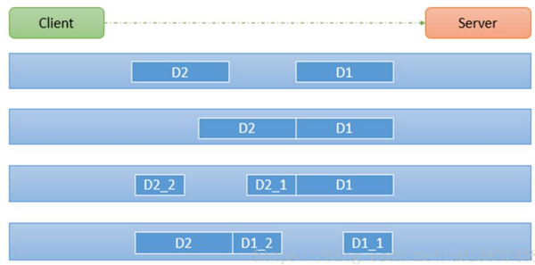
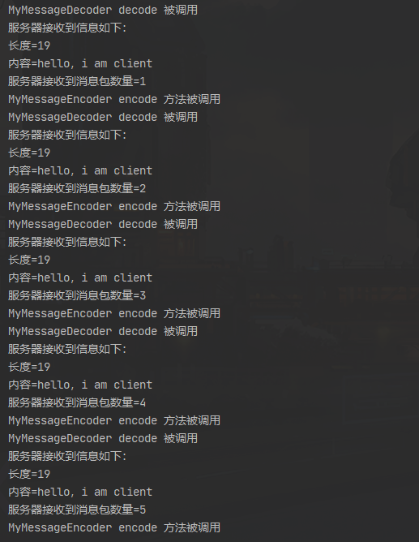
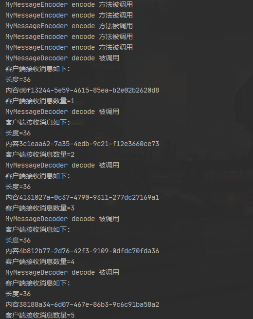

TCP粘包和拆包的基本介绍

1. TCP面向无连接，面向流。收发两端需要成对出现的socket。为了更加有效的发送数据，TCP发送使用了Nagle算法（**只有收到前一数据的ACK消息时，Nagle算法才发送下一数据** ），将多次间隔较小且数据量小的数据，合并成大的数据块，进行封包发送。但是，接收端难以分辨出完整的数据包，因为面向流的通信是无消息保护边界的。
2. TCP数据无消息保护边界，需要在接收端处理边界，即处理粘包、拆包。
3. 示意图如下：



客户端发送了D1，D2两个数据包，服务端一次读取字节数不确定，会存在以下情况：

- 分两次读到了两个独立的数据包，分别为D1，D2，没有粘包与拆包。
- 一次读取了两个数据包，D1和D2粘在一起，发生粘包。
- 第一次读取到完整的D1包和部分D2包，第二次读取到剩下的D2包，发生拆包。
- 与第三种类似。

解决方案

关键就是解决每次读取数据长度的问题

使用自定义的协议+编解码器，规定数据格式，长度，内容等

具体实例

客户端发送5个Message对象，服务端每接收一个Message，回复给客户端一个。

代码如下：

MessageProtocol.java

```java
/**
 * 消息体
 * @author sunhu
 * @date 2020/8/17 18:58
 */
public class MessageProtocol {
    private int len;
    private byte[] content;

    public int getLen() {
        return len;
    }

    public void setLen(int len) {
        this.len = len;
    }

    public byte[] getContent() {
        return content;
    }

    public void setContent(byte[] content) {
        this.content = content;
    }
}

```

MyMessageDecoder.java

```java
/**
 * 解码器，将二进制数据解码，其中包括数据长度与数据内容
 * @author sunhu
 * @date 2020/8/17 19:23
 */
public class MyMessageDecoder extends ReplayingDecoder<MessageProtocol> {
    @Override
    protected void decode(ChannelHandlerContext ctx, ByteBuf in, List<Object> out) throws Exception {
        System.out.println("MyMessageDecoder decode 被调用");
        //二进制-->MessageProtocol
        int length = in.readInt();
        byte[] content = new byte[length];
        in.readBytes(content);

        //封装成MessageProtocol,放入out，传递给下一个Handler 业务处理
        MessageProtocol messageProtocol=new MessageProtocol();
        messageProtocol.setLen(length);
        messageProtocol.setContent(content);
        out.add(messageProtocol);
    }
}
```

MyMessageEncoder.java

```java
/**
 * 编码器，将数据长度和内容编码，对应解码
 * @author sunhu
 * @date 2020/8/17 19:15
 */
public class MyMessageEncoder extends MessageToByteEncoder<MessageProtocol> {
    @Override
    protected void encode(ChannelHandlerContext ctx, MessageProtocol msg, ByteBuf out) throws Exception {
        System.out.println("MyMessageEncoder encode 方法被调用");
        //数据长度写入int
        out.writeInt(msg.getLen());
        //数据内容写入bytes
        out.writeBytes(msg.getContent());
    }
}
```


MyServer.java

```java
/**
 * 服务端
 * @author sunhu
 * @date 2020/8/19 9:20
 */
public class MyServer {

    public void run() throws Exception{
        EventLoopGroup bossGroup = new NioEventLoopGroup(1);
        EventLoopGroup workGroup = new NioEventLoopGroup();

        try {
            ServerBootstrap serverBootstrap= new ServerBootstrap().group(bossGroup, workGroup);
            serverBootstrap.channel(NioServerSocketChannel.class)
                    .option(ChannelOption.SO_BACKLOG,128)
                    .childOption(ChannelOption.SO_KEEPALIVE,true)
                    .childHandler(new ChannelInitializer<SocketChannel>() {
                        @Override
                        protected void initChannel(SocketChannel ch) throws Exception {
                            ChannelPipeline pipeline = ch.pipeline();
                            //pipeline加入自定义编解码器和handler
                            pipeline.addLast("decoder",new MyMessageDecoder());
                            pipeline.addLast("encoder",new MyMessageEncoder());
                            pipeline.addLast(new MyServerHandler());
                        }
                    });
            ChannelFuture channelFuture = serverBootstrap.bind(7000).sync();
            channelFuture.channel().closeFuture().sync();
        }finally {
            bossGroup.shutdownGracefully();
            workGroup.shutdownGracefully();
        }
    }
    public static void main(String[] args) throws Exception {
        new MyServer().run();
    }
}
```

MyServerHandler.java

```java
/**
 * ServerHandler
 * @author sunhu
 * @date 2020/8/19 9:09
 */
public class MyServerHandler extends SimpleChannelInboundHandler<MessageProtocol> {

    private int count;

    @Override
    protected void channelRead0(ChannelHandlerContext ctx, MessageProtocol msg) throws Exception {
        //服务端读取数据，msg已经经过了解码
        int len=msg.getLen();
        byte[] content=msg.getContent();

        System.out.println("服务器接收到信息如下：");
        System.out.println("长度="+len);
        System.out.println("内容=" + new String(content, StandardCharsets.UTF_8));
        System.out.println("服务器接收到消息包数量=" + (++this.count));

        //回复消息
        String responseContent= UUID.randomUUID().toString();
        int responseLen=responseContent.getBytes("UTF-8").length;
        byte[] responseContent2=responseContent.getBytes("UTF-8");
        //创建一个协议包，发送给客户端，会经过编码器进行编码
        MessageProtocol messageProtocol=new MessageProtocol();
        messageProtocol.setLen(responseLen);
        messageProtocol.setContent(responseContent2);
        ctx.writeAndFlush(messageProtocol);
    }
}
```

MyClient.java

```java
/**
 * 客户端
 * @author sunhu
 * @date 2020/8/19 9:27
 */
public class MyClient {
    public void run() throws  Exception{
        EventLoopGroup group=new NioEventLoopGroup();
        try {
            Bootstrap bootstrap = new Bootstrap().group(group);
            bootstrap.channel(NioSocketChannel.class)
                    .handler(new ChannelInitializer<SocketChannel>() {
                        @Override
                        protected void initChannel(SocketChannel ch) throws Exception {
                            ChannelPipeline pipeline = ch.pipeline();
                            pipeline.addLast("decoder",new MyMessageDecoder());
                            pipeline.addLast("encoder",new MyMessageEncoder());
                            pipeline.addLast(new MyClientHandler());
                        }
                    });
            ChannelFuture channelFuture = bootstrap.connect("127.0.0.1", 7000).sync();
            channelFuture.channel().closeFuture().sync();
        }finally {
            group.shutdownGracefully();
        }
    }
    public static void main(String[] args) throws Exception {
        new MyClient().run();
    }
}
```

MyClientHandler.java

```java

/**
 * @author sunhu
 * @date 2020/8/17 19:01
 */
public class MyClientHandler extends SimpleChannelInboundHandler<MessageProtocol> {

    private int count;

    @Override
    protected void channelRead0(ChannelHandlerContext ctx, MessageProtocol msg) throws Exception {
        int len=msg.getLen();
        byte[] content = msg.getContent();
        System.out.println("客户端接收消息如下:");
        System.out.println("长度="+len);
        System.out.println("内容" + new String(content, StandardCharsets.UTF_8));
        System.out.println("客户端接收消息数量=" + (++this.count));
    }

    @Override
    public void channelActive(ChannelHandlerContext ctx) throws Exception {

        for (int i=0;i<5;i++){
            String mes="hello，i am client";
            byte[] content=mes.getBytes(StandardCharsets.UTF_8);
            int length=mes.getBytes(StandardCharsets.UTF_8).length;
            //封装成MessageProtocol，然后经过编码器编码
            MessageProtocol messageProtocol=new MessageProtocol();
            messageProtocol.setLen(length);
            messageProtocol.setContent(content);
            ctx.writeAndFlush(messageProtocol);

        }
    }

    @Override
    public void exceptionCaught(ChannelHandlerContext ctx, Throwable cause) throws Exception {
        System.out.println("异常信息=" + cause.getMessage());
        ctx.close();
    }
}
```

运行结果：

服务端



客户端

