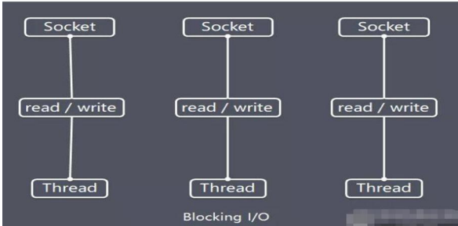
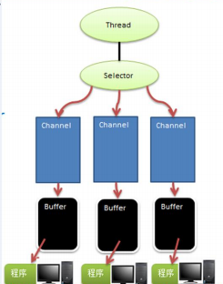

Java BIO编程

I/O模型

I/O模型基本说明

1. 简单理解：就是用什么样的通道进行数据的发送和接收，很大程度决定了程序通信的性能。
2. Java支持3种网络编程模型I/O模式：BIO、NIO、AIO
3. Java BIO：同步阻塞模型，服务器实现模式为一个连接一个线程，即客户端有连接请求时，服务器端就要启动一个线程进行处理。如果这个连接不做任何事，就会造成浪费。示意图如下：
4. Java NIO：同步非阻塞模型。实现方式为一个线程处理多个连接请求，客户端发送的连接请求都会注册到多路复用器上，多路复用器轮询这些连接，有I/O事件就进行处理。示意图如下：
5. Java AIO（NIO.2）: 异步非阻塞。AIO引入了异步通道的概念，采用Proactor模式，有效的请求才会启动线程。其特点是一般由操作系统完成后才通知服务端启动线程去处理，一般适用于连接数较多且连接时间较长的应用。

BIO、NIO、AIO适用场景

- BIO适用于连接数少，且模式固定的架构，对服务器资源要求比较高，程序简单易理解。
- NIO方式适用于连接数多且连接比较短（轻操作）的架构，比如聊天服务器，弹幕系统，服务器间通讯，编程比较复杂。
- AIO方式适用于连接数多且连接比较长（重操作）的架构，比如相册服务器，文件服务器。

Java BIO

基本介绍

- java BIO就是传统的java io 编程，相关的类和接口都在java.io
- BIO(blocking I/O)：同步阻塞，一个连接一个线程，可通过线程池改进

工作机制



流程分析：

1. 服务端启动一个ServerSocket
2. 客户端启动Socket对服务器进行通信，通常情况下，服务端需要对每个客户端建立一个线程与之通信
3. 客户端发出请求后，先咨询服务端是否有线程处理，没有则会一直等待，或者被拒绝
4. 如果有响应，客户端等待请求结束后继续执行

应用实例

使用BIO模型编写服务端，监听6666端口，当客户端连接时，就启动一个线程与之通讯。

BIOServer.java

```java
public class BIOServer {
    public static void main(String[] args) throws Exception{
        //线程池
        ThreadPoolExecutor threadPoolExecutor = new ThreadPoolExecutor(5, 10, 30,
                TimeUnit.SECONDS, new ArrayBlockingQueue<>(512),new ThreadPoolExecutor.DiscardPolicy());
        //一个服务端socket
        final ServerSocket serverSocket=new ServerSocket(6666);

        while (true){
            //有服务端连接,创建一个线程去处理
            final Socket socket = serverSocket.accept();
            threadPoolExecutor.execute(() -> handler(socket));
        }
    }

    public static  void handler(Socket socket){
        byte[] bytes=new byte[1024];
        try {
            //通过socket获取输入流
            InputStream inputStream = socket.getInputStream();
            //输出
            while (true){
                int read = inputStream.read(bytes);
                if (read!=-1){
                    System.out.println(new String(bytes,0,read));
                }else {
                    break;
                }
            }
        } catch (IOException e) {
            e.printStackTrace();
        } finally {
            try {
                socket.close();
            } catch (IOException e) {
                e.printStackTrace();
            }
        }
    }
}
```

Java NIO

基本介绍

- java NIO 全称Java non-blocking IO,也被称为new IO，是同步非阻塞的。
- NIO三大核心：Channel（通道） Buffer（缓冲区）Selector（选择器）
- NIO是面向缓冲区，或者说是面向块编程的。数据会读取到一个它稍后处理的缓冲区，需要时可在缓冲区前后移动
- 非阻塞模式，一个线程发起请求或者读取数据，有数据就读取，没有数据就不获取，而不是保持线程阻塞。直到有数据获取前，该线程可以做其他的事情。非阻塞写也是如此。
- HTTP2.0是完全多路复用的，一个连接即可实现并行，大大提高了处理能力

NIO三大核心

Channel，Buffer，Selector关系图



1. 每个Channel都会对应一个Buffer
2. Selector对应一个线程，一个线程对应对各Channel
3. 程序切换到哪个Channel是由事件决定的，Event是个重要概念
4. Selector 会根据不同事件，在通道之间切换
5. Buffer就是一个内存块，底层是有一个数组
6. 数据的读写都是通过Buffer，NIO的Buffer是双向的，通过flip切换，channel也是双向的

